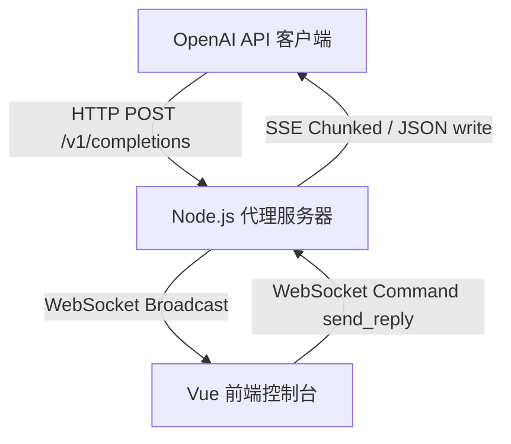

# FakeModel Agent 开发者交接与架构设计白皮书

本说明文档面向未来的 AI Coding Agent 助手及系统维护人员，详细记录了 FakeModel 人工接管 API 代理的核心技术栈实现、状态机演变细节以及底层网络同步机制。

---

## 1. 系统核心架构设计

FakeModel 的工作流是一个经典的 **"同步/异步混合长轮询与双向同步广播"** 架构，可划分为三个核心层级：

---

## 2. 关键核心机制与同步设计

### 2.1 类似 Windows 事件同步原语（`manual_event`）
由于 Node.js 是单线程非阻塞事件循环，而客户端的 HTTP API 请求必须同步挂起等待网页端人工输入作答，因此后端在 `server.js` 中设计了极其巧妙的 `manual_event` 机制，模拟了多协程/多线程间的同步通知：
- **核心原语设计**：
  - `trigger_event(data)`（设置事件）：将事件置为有信号状态，批量通知并唤醒所有正在 Promise 队列中等待该事件的请求，向下回写人工输入的数据。
  - `reset_event()`（重置事件）：清除信号状态，为下一轮多轮对话人工输入做准备。
  - `wait_for_event()`（等待事件）：如果当前处于无信号状态，返回一个挂起的 Promise 并将 resolve 回调塞入队列中，阻塞当前请求 of 执行流。
- **动作函数蛇形命名规范**：遵循全小写加下划线命名（如 `trigger_event`、`reset_event`、`wait_for_event`），杜绝了传统 Windows 开发的匈牙利及驼峰命名，所有变量名直接表明其实际意义。

### 2.2 TCP 物理连接断开判定与“半连接”回收
- **物理强断事件监听**：监听 Response 对象的 `res.on('close')` 事件（而非 `req.on('close')`），确保在请求体被读取解析完后，依旧能精确感知到底层 TCP 的关闭。
- **状态流转双重启发式规则**：
  1. **异常断开 (Disconnected)**：如果连接断开时，`res.writableEnded === false` 且最后一条消息为用户发送的消息，代表人工还未来得及回复，客户端就强行终止了进程。此时后端判定为物理断开，将状态置为 `disconnected`，并向前端广播 `client_disconnected` 事件。
  2. **正常回复断开 (Replied)**：如果连接断开时，`res.writableEnded === true` 或人工已向客户端写回了部分数据，这属于客户端接收完毕后的标准挥手关闭。状态标记为正常的 `replied`，以防止误报错误。
- **前后台状态对齐**：前端在接收到 `client_disconnected` 消息时，使用 Vue 的响应式变更，将会话卡片状态更新为“已结束”。同时，底部文本框进入 `:disabled="true"` 状态，彻底杜绝了状态不同步的 bug。

### 2.3 前端 UI 极致交互与国际化（i18n）
- **编辑框焦点零闪烁**：
  - 取消了发送过程中动态对 `textarea` 的 `:readonly` 变动，只在彻底断开或结束时使用 `:disabled`，以避免浏览器重绘引起的输入光标失去焦点。
  - 流式响应广播更新时，前端仅重置发送锁 `is_submitting.value = false`，不强行调用 `focus()`，彻底消除了“焦点闪烁”的交互瑕疵。
- **鼠标拖拽侧边栏（LocalStorage 记忆）**：
  - 左侧历史列表（`.sidebar`）和右侧挂载工具（`.tools-sidebar`）均带有拖拽手柄 `.resize-handle`。
  - 通过鼠标 `mousedown`、`mousemove` 与 `mouseup` 全局监听器，动态计算并限幅边栏宽度（200px ~ 600px）。在拖拽完毕后，将宽度存入本地 `localStorage`，并在挂载时优先载入恢复，满足大屏和多分辨率屏幕排版需求。
- **消息气泡（Bubble）防遮挡折叠布局**：
  - 重构了气泡结构，通过包裹层 `.message-bubble-body` 承载圆角与背景色，将消息文本与折叠按钮一起包含在气泡内部。
  - 折叠按钮使用 `align-self: flex-end` 强制居于气泡内右下角。由于采用文档流 Flex 排版，即使文字内容极长，也绝对不会发生按钮悬浮重叠文字的问题。
- **网页标题动态同步更新**：
  - 修正了 `gui/index.html` 的默认网页标题为 `FakeModel 控制中心`。
  - 在前端 `App.vue` 脚本中，增加了对当前语言计算属性（`current_lang`）的监听器（watch 机制），一旦多语言发生改变，即刻动态调用 `document.title` 同步刷新浏览器的网页标题（中文环境为“FakeModel 控制中心”，英文环境为“FakeModel Control Panel”）。

### 2.4 嵌入式静态托管与 Fallback 安全过滤
- **资源就地防 fallback 过滤器**：
  - 在托管模式下，所有的前端编译产物都直接存储在根目录的 `public` 下，由根目录的 `server.js` 统一接管路由响应。
  - 为了应对单页应用（SPA）的 HTML 路由回退需求，后端加入了安全过滤器：当请求的文件在 `public/` 下不存在时，首先通过 `path.extname` 检查。如果是请求非 HTML 的具体静态文件（如以 `.js` 或 `.css` 等结尾的资源），服务器将不执行 fallback，直接安全返回真正的 **404 静态资源未找到**，以此避免浏览器控制台加载到 HTML 源码报 `Unexpected token` 语法解析错。

### 2.5 API Key 与 IP 隔离绑定安全机制
- **隔离绑定决策机制**：
  为了解决原本公共对话流导致的前端越权读取请求以及多用户串线问题，系统引入了安全隔离模型：
  1. **Key 模式绑定**：当前端 GUI 与请求客户端均配置并携带 API Key 时，后端进行 Key 精确比对绑定；
  2. **IP 模式绑定**：若双方均未填写 API Key，后端将自动采集客户端的请求 IP 与前端控制台连接的 IP，并进行匹配绑定以完成本地网络安全隔离。
- **未在线连接拦截与警告**：
  当客户端发起聊天对话请求时，后端主程序（`server.js`）会在第一时间调用助手函数（如 `has_active_gui_connection`）进行在线状态探活。若发现没有匹配该 Key（或没有配置 Key 时无相同 IP）的活跃前端 WebSocket 连接，则请求直接被拦截。后端会伪装成 OpenAI 返回消息，向客户端回写详细的中英双语拦截警告（兼容流式 SSE 的 `[DONE]` 封包和标准 JSON 结构），避免请求无意义挂起并指引用户在前端控制中心顶部输入 Key 进行配对。
- **越权防御与隔离清空**：
  在 WebSocket 交互指令中，会话列表获取、单个会话删除以及清空全部会话的操作，均在后端层进行了严格的 Key/IP 双重防越权过滤，前端无法通过 WS 指令影响或清除不属于自己绑定范围内的任何会话记录。

---

## 3. 根目录工程化管理与 VS Code 任务链架构

为了提高大模型人工接管代理系统的整体编译与发布效率，项目在基础架构层进行了工程化重构：
- **项目根目录工程化**：在主工作区增加了全局 `package.json`，提供跨模块执行脚手架。
  - `npm run build`：一键打包前端（执行 `npm run build --prefix gui` 编译前端资产并输出至后端托管目录）。
  - `npm start`：启动 Node 后端托管服务器。
- **VS Code 双轨启动任务**：重写并升级了 `.vscode/tasks.json` 任务配置：
  - **开发调试轨 (热更新)**：运行任务 `启动开发环境 (热更新双端)`，会以 `parallel` 模式同时并行拉起后端 Server 监听（`3001`）与 GUI 开发调试服务器（`5173`），供二次开发实时联调。
  - **打包发布源码压缩包 (tar.gz)**：运行任务 `打包发布源码压缩包 (tar.gz)`，会将前端构建好的 `public` 静态目录、后端服务入口 `server.js`、配置依赖说明文件 `package.json` 与主说明文档 `README.md` 自动归档压缩为 `fakemodel-release.tar.gz` 压缩包，用于 1Panel、宝塔等 Linux 面板中一键上传部署。

---

## 4. 面向未来 Agent 的维护指引

在后续的开发演进中，请重点遵循以下规范：

1. **中文日志与注释约束**：
   - 所有的自定义函数、类与逻辑文件，必须配以详尽的中文注释。
   - 所有运行时输出到控制台或文件日志的打印信息，必须使用中文回答与表述。
2. **蛇形命名强制执行**：
   - 无论是前端的 Vue 逻辑还是后端的 Node.js 原生逻辑，新增的自定义函数名与变量名必须采用小写字母加下划线命名法（如 `my_new_helper_method`），禁止出现大小驼峰（`myNewHelper`）或匈牙利前缀。
3. **Windows 内核概念对齐**：
   - 在涉及高并发或通信机制设计时，描述必须严格对齐 Windows 原生内核对象（例如：“事件 Event”、“临界区 Critical Section”、“句柄 Handle”），一律禁止使用 Linux API 术语。
4. **文档与代码修改同步约束**：
   - **【强制规则】** 当系统在功能模块、核心配置文件（如 `tasks.json`、`package.json`）、架构逻辑（如 `server.js` 托管规则）或编译输出链路发生任何变更时，AI Coding Agent 助手或系统开发人员**必须同步更新本说明文档**，并将详细的升级细节、新增原语及架构逻辑及时补充记录到本白皮书中；同时，**若使用方式（如运行指令、启动任务等）发生变化，也必须一并同步更新项目主目录下的 README.md 说明文档**，严禁文档与系统实际架构/使用指南不同步。
